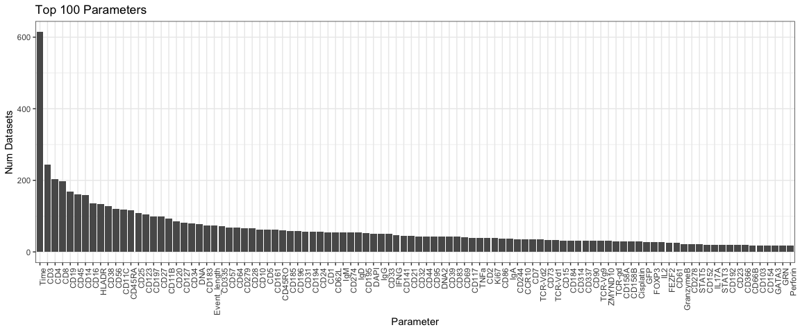

Metadata Overview
================

``` r
library(tidyverse)
library(knitr)
df_exp <- read_csv('data/experiments.csv', col_types=list())
df_kwd <- read_csv('data/keywords.csv', col_types=list())
df_fcs <- read_csv('data/fcs_files.csv', col_types=list())
df_chl <- read_csv('data/fcs_channels_resolved.csv', col_types=list())
set.seed(1)
```

``` r
df_exp %>% select(-attachments) %>% sample_n(5) %>% kable()
```

| exp\_id     | exp\_name                                                                                                                                             | investigators   | researchers       |  n\_fcs\_files\_total|  n\_fcs\_files\_parse|
|:------------|:------------------------------------------------------------------------------------------------------------------------------------------------------|:----------------|:------------------|---------------------:|---------------------:|
| FR-FCM-ZZCB | Effect of monensin on IFNg mRNA and Protein expression                                                                                                | Emily Park      | Chip Lomas        |                    12|                    12|
| FR-FCM-ZZG6 | data analysis activated sludge                                                                                                                        | Susanne Günther | Susanne Günther   |                    10|                    10|
| FR-FCM-ZZUE | B-1 phenotype of peripheral CD19+ Mac-1+ B cells of a representative recipient of DL1-Fc 2.5-activated ESC-HSC\_Fig.1E, S1B, S2A-B                    | yifen lu        | yifen lu          |                    32|                    30|
| FR-FCM-ZYWC | BRAF and MEK inhibitor therapy eliminates nestin expressing melanoma cells in human tumors Experiment 5 (Additional Therapy Naive Patients All Cells) | Jonathan Irish  | Deon Doxie        |                     3|                     3|
| FR-FCM-ZZ8P | Figure 1-B Autophagy Sonication                                                                                                                       | Kui Lin         | Michael Degtyarev |                    84|                    30|

``` r
df_kwd %>% sample_n(5) %>% kable()
```

| exp\_id     | keyword                 |
|:------------|:------------------------|
| FR-FCM-ZYHL | automated data analysis |
| FR-FCM-ZYMF | mass cytometry          |
| FR-FCM-ZZVF | FACSDiva                |
| FR-FCM-ZZU7 | Silver nanoparticles    |
| FR-FCM-ZZ3L | fluorescence            |

``` r
df_fcs %>% sample_n(5) %>% kable()
```

| exp\_id     | version | filename                                            |      size| creator                            |  n\_params|
|:------------|:--------|:----------------------------------------------------|---------:|:-----------------------------------|----------:|
| FR-FCM-ZZ8S | FCS3.0  | DMSO\_D1\_D01.fcs                                   |    239547| NA                                 |          5|
| FR-FCM-ZZ7U | FCS3.0  | 768243.fcs                                          |  15093818| BD FACSDiva Software Version 6.1.1 |         16|
| FR-FCM-ZY6D | FCS3.0  | Compensation Controls\_APC Stained Control\_008.fcs |    282686| BD FACSDiva Software Version 8.0.1 |         14|
| FR-FCM-ZZFM | FCS2.0  | TS22 652 P6…Live.fcs                                |  24509776| FlowJo                             |         22|
| FR-FCM-ZYAY | FCS2.0  | Donor9 NK phenoD4\_TW NK+IL-2 mixA 004.LMD          |    107989| NA                                 |         13|

``` r
df_chl %>% sample_n(5) %>% kable()
```

| param\_channel | param\_name | filename                                   | exp\_id     | term |  precedence| param       | resolution |
|:---------------|:------------|:-------------------------------------------|:------------|:-----|-----------:|:------------|:-----------|
| Time           | NA          | AJO 3min no tto\_0 min PETG.fcs            | FR-FCM-ZY2D | TIME |           3| Time        | lookup     |
| Tm169Di        | 169Tm\_ICOS | 081216-Mike-HIMC ctrls-885d4\_01\_1.fcs    | FR-FCM-ZYAJ | ICOS |           5| CD278       | lookup     |
| Yb171Di        | 171Yb\_CD27 | Plate 8\_9.fcs                             | FR-FCM-ZYT6 | CD27 |           5| CD27        | lookup     |
| Y4-A           | PE-Vio770-A | A555\_Acceptor.fcs                         | FR-FCM-ZZR6 | NA   |           6| PE-Vio770-A | original   |
| Xe131Di        | 131Xe       | Clambey LO 11022016 IL10 KO lung 4\_01.fcs | FR-FCM-ZYDW | NA   |           6| 131Xe       | original   |

``` r
df_chl %>% 
  # Ignore any parameter names that couldn't be matched (results are too messy otherwise)
  filter(resolution == 'lookup') %>%
  
  # Get distinct set of experiment ids and parameter names
  group_by(exp_id, param) %>% tally %>% select(-n) %>% ungroup %>%
  
  # Count and plot parameter frequencies
  group_by(param) %>% tally %>% arrange(desc(n)) %>% head(100) %>%
  mutate(param=reorder(param, -n)) %>%
  ggplot(aes(x=param, y=n)) + geom_bar(stat='identity') + 
  labs(x='Parameter', y='Num Datasets', title='Top 100 Parameters') +
  theme_bw() +
  theme(axis.text.x = element_text(angle = 90, hjust = 1))
```


